<div class="MCWHeader1">
Business continuity and Disaster recovery
</div>

<div class="MCWHeader2">
Hands-on lab step-by-step
</div>

<div class="MCWHeader3">
May 2020
</div>

# Business continuity and disaster recovery hands-on lab step-by-step 

**Contents**

<!-- TOC -->

- [Business continuity and disaster recovery hands-on lab step-by-step](#business-continuity-and-disaster-recovery-hands-on-lab-step-by-step)
  - [Abstract](#abstract)
  - [Overview](#overview)
  - [Solution architecture](#solution-architecture)
	- [Environment: Azure (Azure)](#environment-azure)
	- [Environment: On Premises (failover to Azure)](#environment-on-premises)
	- [Environment: Azure PaaS (Log Analytics and Azure Monitor)](#environment-azure-paas)
  - [Requirements](#requirements)
  - [Exercise 1: Prepare Azure Infrastructure](#exercise-1-prepare-azure-infrastructure)
	- [Task 1: Create Resource Group](#task-1-create-resource-group)
	- [Task 2: Deploy Virtual Networks](#task-2-deploy-virtual-networks)
	- [Task 3: Deploy VPN Service](#task-3-deploy-vpn-Service)
  - [Exercise 2: Configure BCDR services](#exercise-2-configure-bcdr-services)
	- [Task 1: Create Azure recovery services vault](#task-1-create-azure-recovery-services-vault)
	- [Task 2: Connect your On Premises Environment](#task-2-connect-your-on-premises-environment)
  - [Exercise 3: Configure Log Analytics Workspace](#exercise-3-configure-log-analytics-workspace)
	- [Task 1: Create Log Analytics Workspace](#task-1-create-log-analytics-workspace)
	- [Task 2: Deploy Log Analytics Agents](#task-2-connect-your-on-premises-environment)
	- [Task 3: Deploy Service Map Solution](#task-3-deploy-service-map-solution)
	- [Task 4: Deploy Security Center Solution](#task-4-deploy-security-center-solution)
	- [Task 5: Deploy Network Monitor Solution](#task-5-deploy-network-monitor-solution)
	- [Task 6: Enable Azure Monitor](#task-6-enable-azure-monitor)

<!-- /TOC -->


## Abstract

In this hands-on lab, you will implement a hybrid environment and use Azure BCDR technologies to achieve three objectives for this environment. These objectives include a Disaster Recovery to Azure, Azure On Premises-to-Azure failover, and an Azure Monitor implementation using Log Analytics technologies to ensure continuous monitoring of an application.

At the end of this hands-on lab, you will be able to design and build complex and robust IaaS BCDR solutions.  

## Overview

The Business continuity and disaster recovery hands-on Lab is an exercise that will challenge you to implement a BCDR solution that includes your on premises environment and uses Azure BCDR technologies to achieve three distinct goals for each environment. These objectives include a Disaster Recovery to Azure, Log Analytics implementation for Service Map, and Azure Monitor integration using Log Analytics technologies.


## Solution architecture

Below are diagrams of the solution architecture you will build in this lab. Please study this carefully, so you understand the whole of the solution as you are working on the various components.

### Environment: Azure 

- **Background:** You will prepare the Azure Infrastructure in order to provide Disaster Recovery and Monitoring Services to your On premises Infrastructure. Several Microsoft Azure solutions can be also enabled to provide your Security Insights, Network Monitoring and Dependency Mapping. 

- **Goal using Azure BCDR:** Your goal for this environment will be to enable the Azure Environment to host your Disaster Environment infrastructure. Service enablement, Virtual Networks and Log Analytics workspace.

    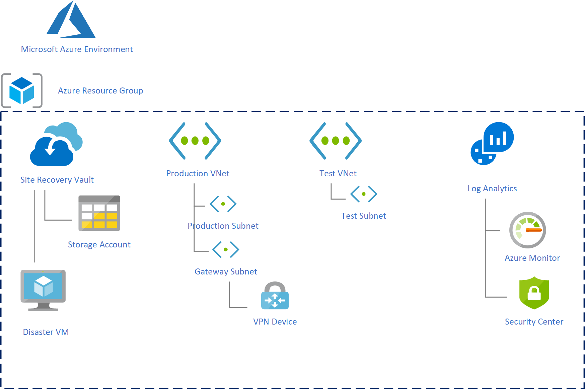

### Environment: On premises

- **Background:** Your existing environment will be used with Hyper-V or VMWare virtualization. You will choose an existing VM or create a new Linux or Windows VM to protect it through Azure Site Recovery..

- **Goal using Azure BCDR:** Your goal for this environment will be to enable Business Continuity to this server/application to Azure IaaS with a one-direction failover.

    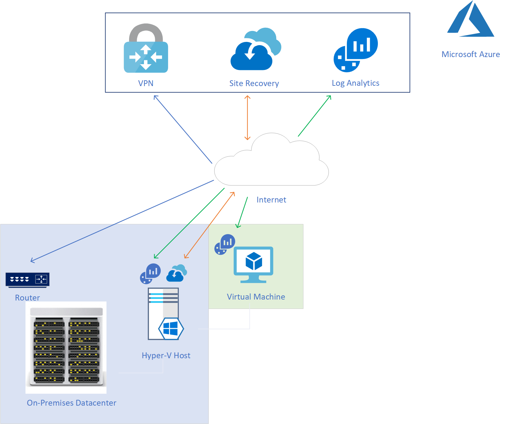

### Environment: Azure PaaS Services (Log Analytics Solutions)

- **Background:** You will be able to enable Monitoring Solutions for your on premises and cloud environment through Azure Log Analytics Service. Also Azure Security Center with assess your existing environment and through Azure Monitor you will be able to review your systems insights.

- **Goal using Azure BCDR:** Your goal for this environment is to configure the PaaS services, connect your agents to the service, enable the solutions and review the results.

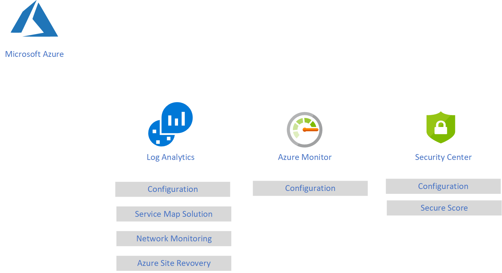

## Requirements

1. An Azure Subscription with full access to the environment.

## Exercise 1: Prepare Azure Infrastructure

Duration: 30 minutes

In this exercise, you will follow the Step By Step Guide to deploy the Azure Services and configure the environment.

- **Azure Environment:** This environment will consist of two Virtual Networks deployed on one resource group. Services that be will enables will deployed under this Resource Group.

### Task 1: Create Resource Group

1. From **Your Device**, open your favorite browser (**Edge**) and connect to the Azure portal at: <https://portal.azure.com>.

2. Select **+Create a resource** and then search for **Resource Group**.

3. Select **Add**

    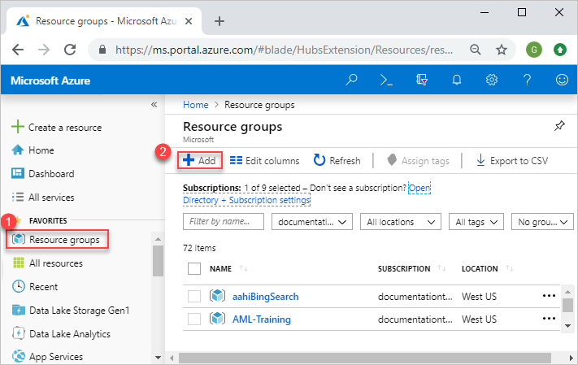

3. Enter the following values:
	- **Subscription**: Select your **Azure subscription**.
	- **Resource group**: Enter a new resource group name, such **BCDRRG**
	- **Region**: Select an Azure location, such as **West Europe**


    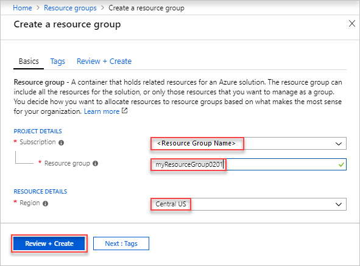

4. Select **Review + Create**.

5. Select **Create**. It takes a few seconds to create a resource group.

6. Select **Refresh** from the top menu to refresh the resource group list, and then select the newly created resource group to open it. Or select **Notification** (the bell icon) from the top, and then select **Go to resource group** to open the newly created resource group.

    


### Task 2: Deploy Virtual Networks

1. From **Your Device**, open your favorite browser (**Edge**) and connect to the Azure portal at: <https://portal.azure.com>.

2. Select **+Create a resource** and then search for **Virtual Networks**.

3. Select **Add**.

4. On the Virtual Network Wizard enter the following.
	- **Subscription**: Select your **Azure subscription**.
	- **Resource group**: Select your existing resource group name,**BCDRRG**
	- **Name**: Enter **Cloud\_VNet\_Production**.
	- **Region**: Select the Azure location, **(Europe) West Europe**

    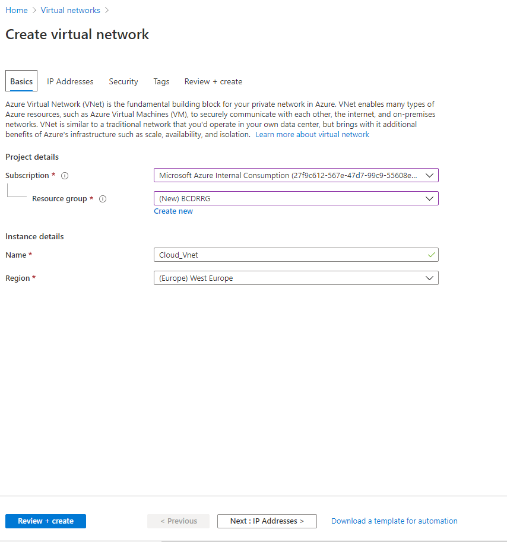

5. Select **Next: IP Addresses**.

6. On the IP Address enter **10.200.0.0/16**.

    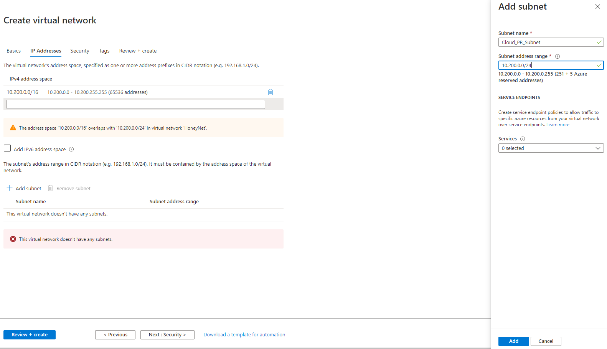

6. Select **+ Add subnet**, then on the Subnet Name enter **Cloud\_PR\_Subnet** and for Subnet address range add **10.200.0.0/24**.

7. Select **Add**, then select **Review + create**. Leave the rest as default and select **Create**.

8. In Create virtual network, select **Create**.

9. Use the Above process to create a new Virtual Network and subnet.
	- **Subscription**: Select your **Azure subscription**.
	- **Resource group**: Select your existing resource group name,**BCDRRG**
	- **Name**: Enter **Cloud\_VNet\_Disaster**.
	- **Region**: Select the Azure location, **(Europe) West Europe**
	- **IP Address**: **10.220.0.0/24**
	- **Subnet Name**: **Cloud\_DR\_Subnet**
	- **Address Range**: **10.220.0.0/27**

	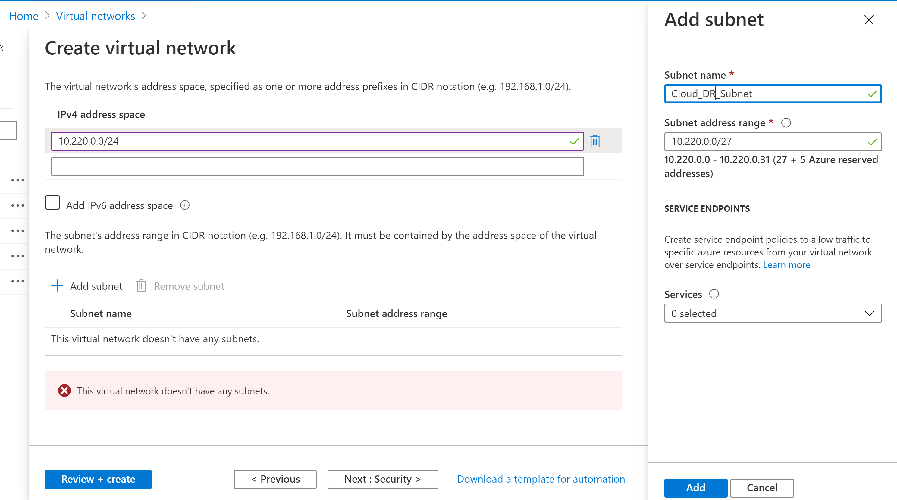


### Task 3: Deploy VPN Service

1. From **Your Device**, open your favorite browser (**Edge**) and connect to the Azure portal at: <https://portal.azure.com>.

2. Search for and select **Virtual networks**.

3. Select **Cloud\_VNet\_Production**.

4. From the left blade select **Subnets**.
	
	 

3. Select **+ Gateway Subnet**.

4. On the **Add subnet** dialog box enter the following.
	- **Name**: **Gateway Subnet**.
	- **Address Range**: **10.200.254.0/24** and press **OK**.

	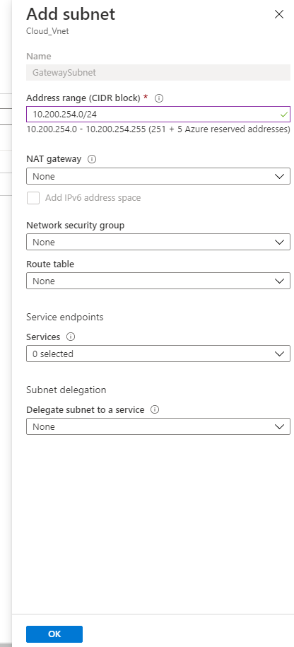 

5. Search for and select **Virtual Network Gateways**.

	

6. Select **+ Add**

7. In the **Create Virtual Network Gateway** enter the following details.
	- **Subscription**: Select your **Azure subscription**.
	- **Name**: Enter **Cloud\_VNet\_Production\_VPN**
	- **Region**: Select your Azure location, **(Europe) West Europe**
	- **Gateway Type**: Select **VPN**.
	- **VPN Type**: Select **Route-based**.
	- **SKU**: Select **Basic**.
	- **Generation**: Select **Generation1**.

	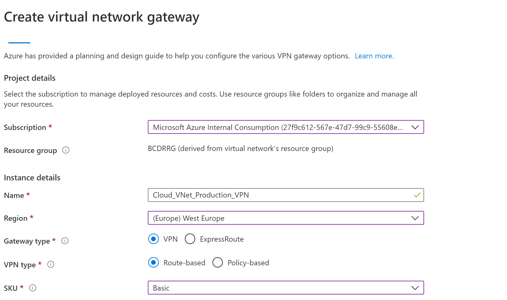

	- **Virtual Network**: Select your Production Network **Cloud\_VNet\_Production**
	- **Subnet Name**: **Cloud\_DR\_Subnet**
	- **Public IP Address**: Select **Create New**
	- **Public IP Address Name**: Enter **VPN\_PROD\_IP**
	- **Enable active-active mode**: Select **Disabled**
	- **Configure BGP ASN**: Select **Disabled**


	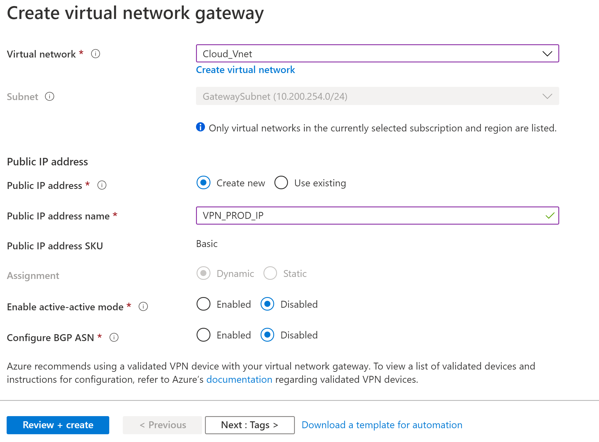

8. Select **Review + create** and select **Create** to deploy.

> **Note: ** This step can take up to 45 minutes to complete, but you can continue to the next exercise.


## Exercise 2: Configure BCDR services

Duration: 30 minutes

In this exercise, you will create and configure the services that will make it possible to failover  the on-premises environment. These will include a Recovery Services Vault used for Azure Site Recovery.

### Task 1: Create Azure recovery services vault

1. From **Your Device**, open your favorite browser (**Edge**) and connect to the Azure portal at: <https://portal.azure.com>.

2. Select **+Create a resource**, then enter **Backup and Site Recovery**, and select **Create**.

    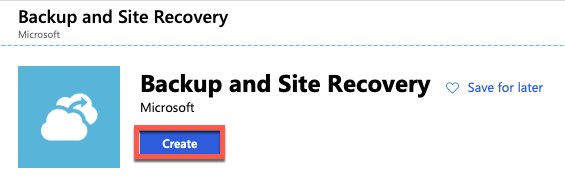

3. Complete the **Recovery Services Vault** blade using the following inputs, then select **Create**:

    - **Name**: `BCDRCLOUDSRV`
    - **Resource Group**: Select **BCDRRG**.
    - **Location**: Select **West Europe**.
    - Select **Review + Create**. It takes a few seconds to create the Vault.

	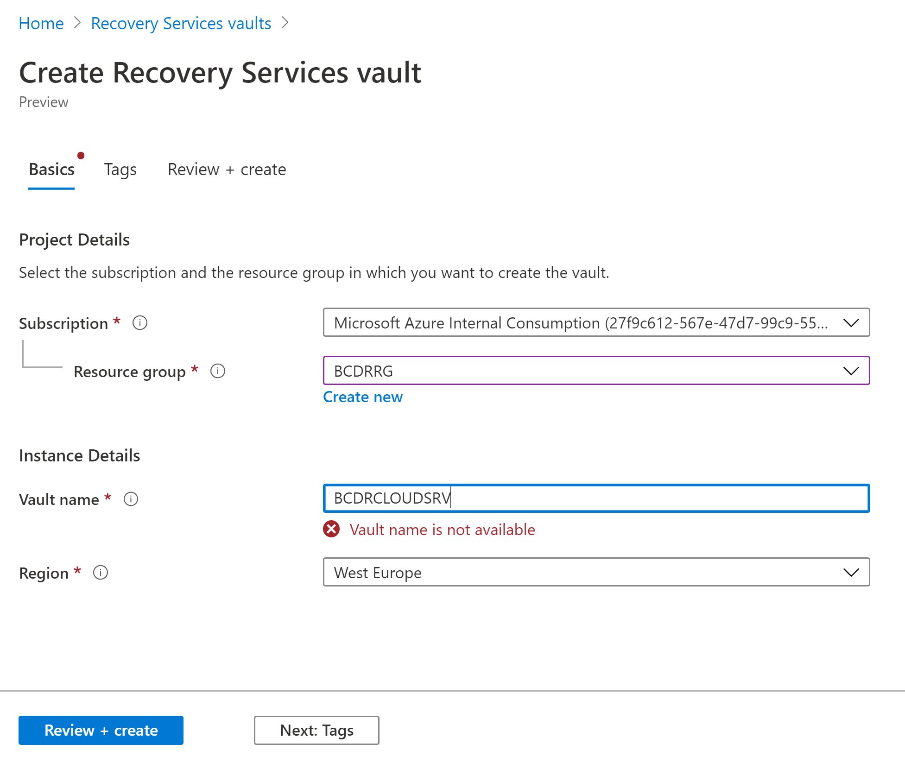

4. Once the **BCDRRSV** Recovery Service Vault has been created, open it in the Azure portal. Select the "Site Recovery" tab.

    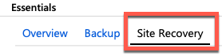

5. This is your dashboard for Azure Site Recovery (ASR), for the HOL.

    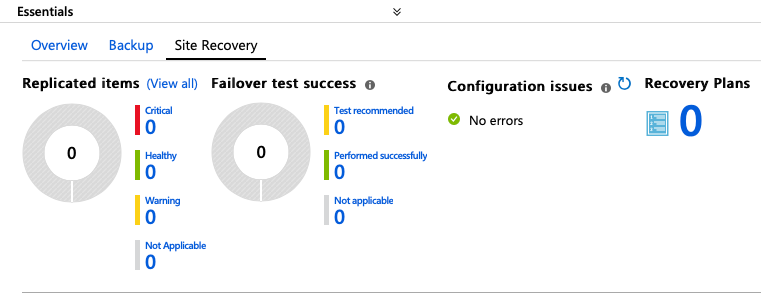


### Task 2: Connect your On Premises Environment

1. For your Hyper-V Environment Follow the **Hyper-V** guide.[Hyper-V Environment](Hyper-V%20Environemt%20Preparation.md) 

2. For your VMWare Environment Follow the **VMWare** guide. [VMWare Environment](VMWare%20Environment%20Preparation.md) 


## Exercise 3: Configure Log Analytics Workspace

### Task 1: Create Log Analytics Workspace

Use the **Log Analytics workspaces** menu to create a Log Analytics workspace using the Azure portal. A Log Analytics workspace is a unique environment for Azure Monitor log data. Each workspace has its own data repository and configuration, and data sources and solutions are configured to store their data in a particular workspace. You require a Log Analytics workspace if you intend on collecting data from the following sources:


1.  From **Your Device**, open your favorite browser (**Edge**) and connect to the Azure portal at: <https://portal.azure.com>.

2. In the Azure portal, click **All services**. In the list of resources, type **Log Analytics**. As you begin typing, the list filters based on your input. Select **Log Analytics workspaces**.

    
  
2. Click **Add**, and then select choices for the following items:

   * Provide a name for the new **Log Analytics workspace**, such as *companylogsworkspace*. This name must be globally unique across all Azure Monitor subscriptions.
   * Select a **Subscription** to link to by selecting from the drop-down list if the default selected is not appropriate.
   * For **Resource Group**, select 
   * **Resource Group**: Select **BCDRRG**.
   * **Location**: Select **West Europe**.

        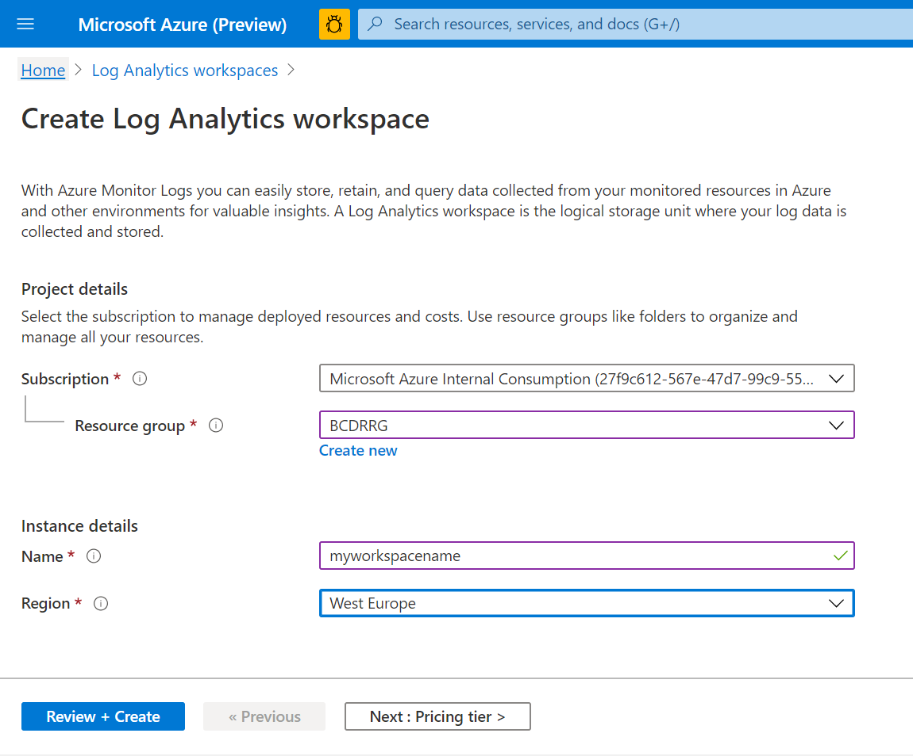

3. After providing the required information on the **Log Analytics Workspace** pane, click **Review + Create** and then **Create** to proceed.  

4. Go to Log Analytics workspace that you create earlier select **Agents Management**. Copy your ** Workspace ID** and your **Primary Key** into a txt document in your **Device**. We will use this information in order to register the `Log Analytics Agents` into the workspace.

	 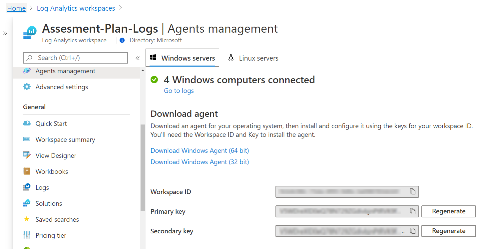

### Task 2: Deploy Log Analytics Agents

In your Log Analytics workspace, from the **Windows Servers** page you navigated to earlier, select the appropriate **Download Windows Agent** version to download depending on the processor architecture of the Windows operating system.

> For Windows Servers
   
1. Run Setup to install the agent on your computer.

2. On the **Welcome** page, click **Next**.

3. On the **License Terms** page, read the license and then click **I Agree**.

4. On the **Destination Folder** page, change or keep the default installation folder and then click **Next**.

5. On the **Agent Setup Options** page, choose to connect the agent to Azure Log Analytics and then click **Next**.   

6. On the **Azure Log Analytics** page, perform the following:
   * Paste the **Workspace ID** and **Workspace Key (Primary Key)** that you copied earlier.  
   * If the computer needs to communicate through a proxy server to the Log Analytics service, click **Advanced** and provide the URL and port number of the proxy server.  If your proxy server requires authentication, type the username and password to authenticate with the proxy server and then click **Next**.  

7. Click **Next** once you have completed providing the necessary configuration settings.<br><br> 
	<br><br>

8. On the **Ready to Install** page, review your choices and then click **Install**.

9. On the **Configuration completed successfully** page, click **Finish**.

> For Linux Servers

* [Manually download and install](#https://github.com/MicrosoftDocs/azure-docs/blob/master/articles/azure-monitor/platform/agent-linux.md#install-the-agent-manually) the agent.

1. [Download](https://github.com/microsoft/OMS-Agent-for-Linux#azure-install-guide) and transfer the appropriate bundle (x64 or x86) to your Linux VM or physical computer, using scp/sftp.

2. Install the bundle by using the `--install` argument. To onboard to a Log Analytics workspace during installation, provide the `-w <WorkspaceID>` and `-s <workspaceKey>` parameters copied earlier.


    ```
    sudo sh ./omsagent-*.universal.x64.sh --install -w <workspace id> -s <shared key>
    ```
### Task 3: Deploy Service Map Solution

1.  From **Your Device**, open your favorite browser (**Edge**) and connect to the Azure portal at: <https://portal.azure.com>.

2. Go to your **Log Analytics Workspace**
	
	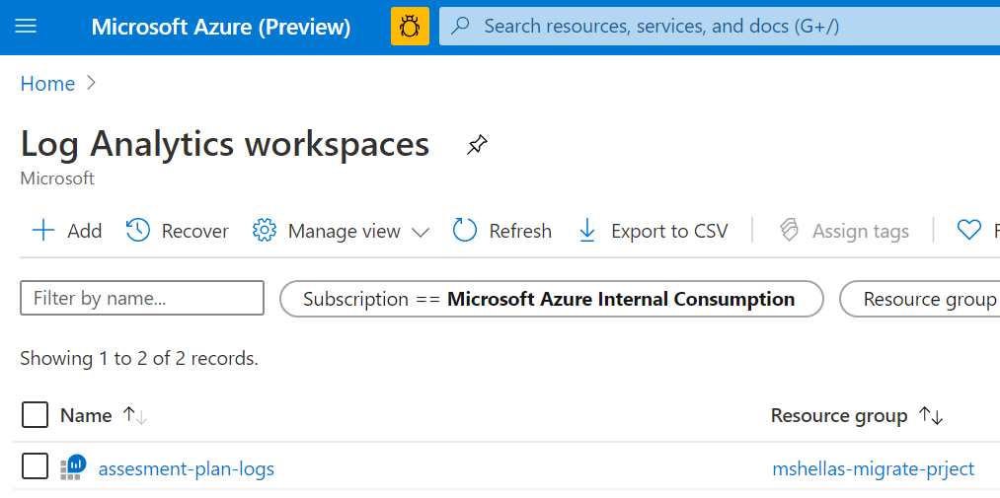

3. Go to **Workspace Summary** and click on **+ Add**.

	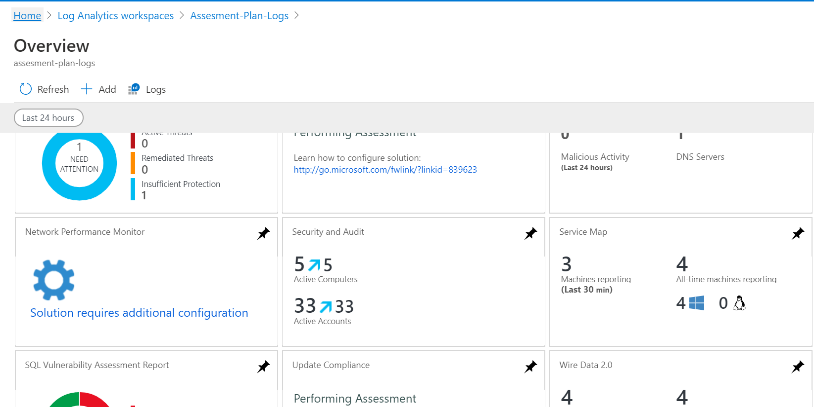

4. **Solution Marketplace** will open, on the search box enter **Service Map** and press `Enter`.

	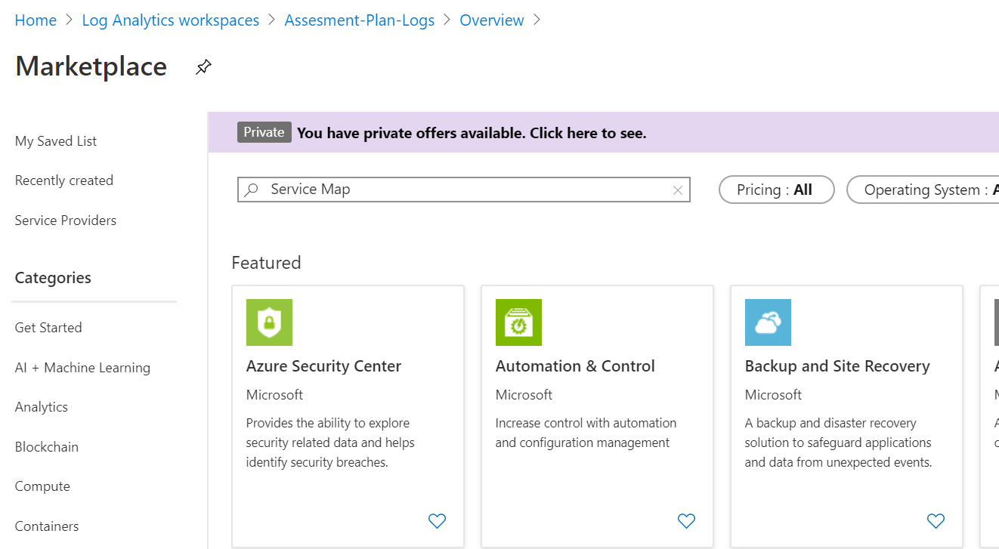

5. On the **Service Map** solution press **Create**.

	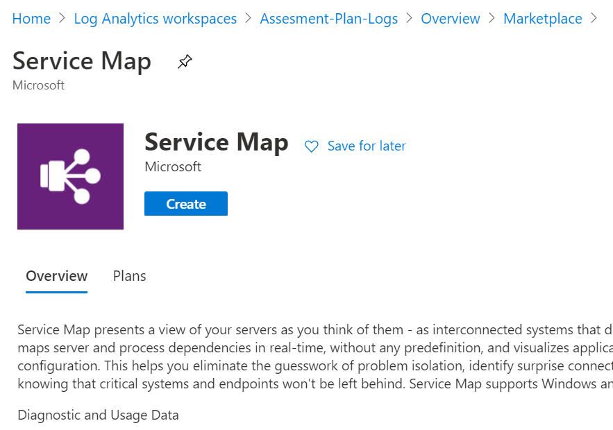

6. Select your **Log Analytics Workspace** press **Create**.

	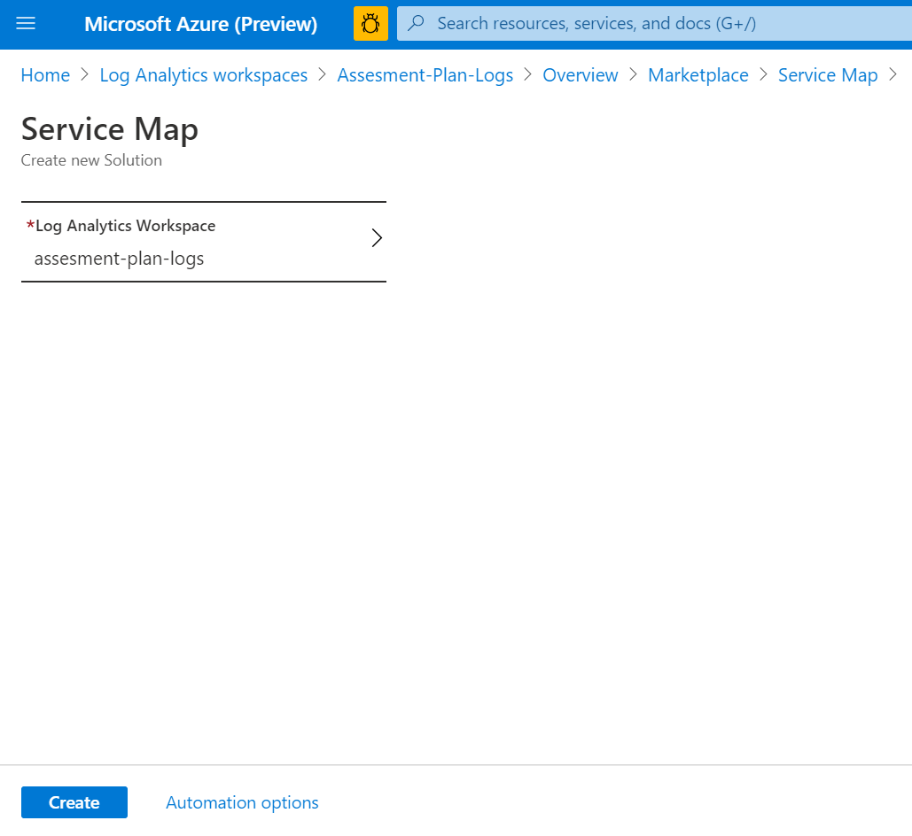

7. Select your **Log Analytics Workspace** press **Create**.

	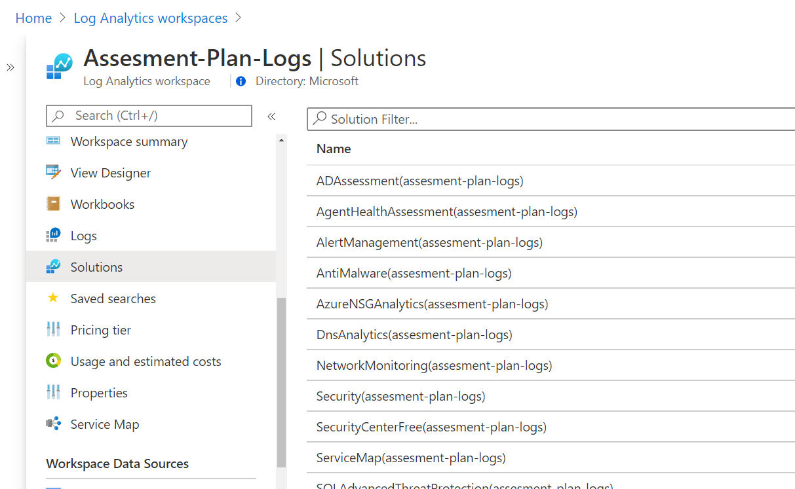

8. Install the Dependency agents on your **On Premises** virtual machines.

>[Dependency Agent for Windows](https://aka.ms/dependencyagentwindows)

>[Dependency Agent for Linux](https://aka.ms/dependencyagentlinux)

9. Go to **Assessment-Plan-Logs | Solutions** and select **Service Map**

10. On the Summary click on **View Summary** and then click on the **Solution**.

	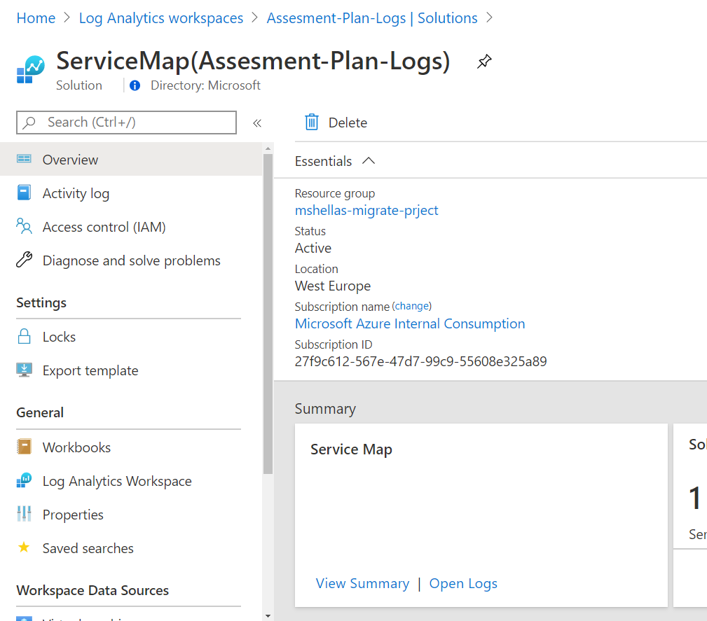

11. Select your server from the left blade and review the **Service Map**. You can revire all of the components of service map following the documentation [**Here**](https://docs.microsoft.com/en-us/azure/azure-monitor/insights/vminsights-maps)

	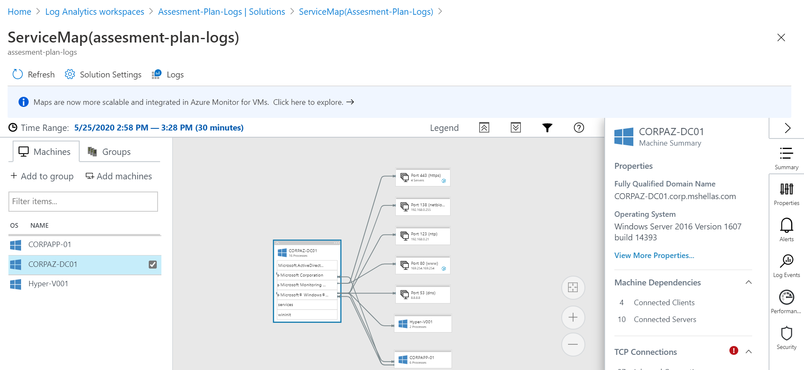


### Task 4: Deploy Security Center Solution

1.  From **Your Device**, open your favorite browser (**Edge**) and connect to the Azure portal at: <https://portal.azure.com>.

2. On the Microsoft Azure menu, select Security Center. Security Center - Overview opens.

	

3. Under the Security Center main menu, select **Getting started**

4. Select your **Log Analytics Workspace** you created earlier and click **Upgrade**. This is a monthly trial and allows you to have [**Windows Server Defender ATP**](https://docs.microsoft.com/en-us/windows/security/threat-protection/microsoft-defender-atp/configure-server-endpoints) automated **Vulnerability Assessments** with [**Qualys**](https://docs.microsoft.com/en-us/azure/security-center/built-in-vulnerability-assessment). 

5. Go to **Secure Score** and click **Review your Security Score**

	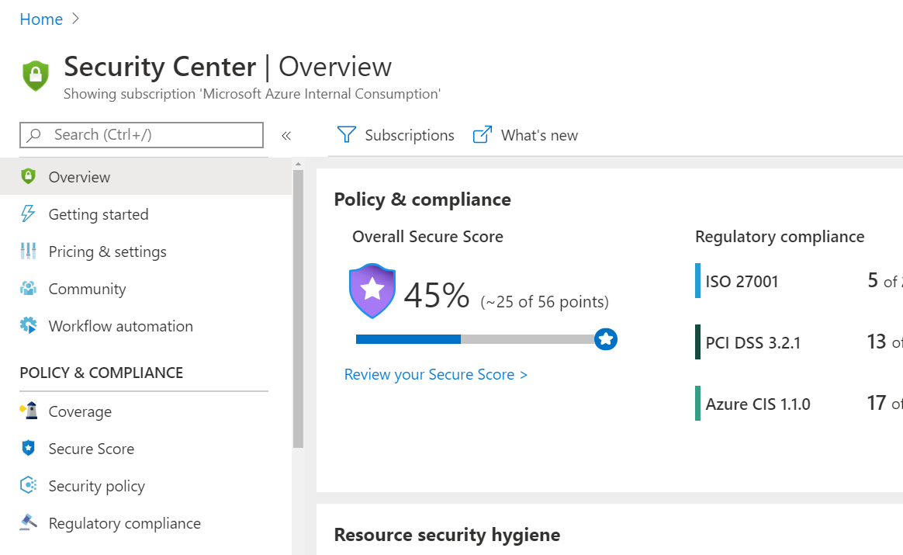

6. Next to you Subscription click on **View recommendations**

	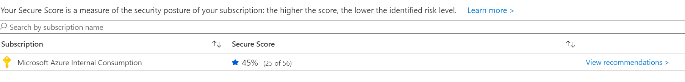

7. Review your `Security recommendation`.
	
	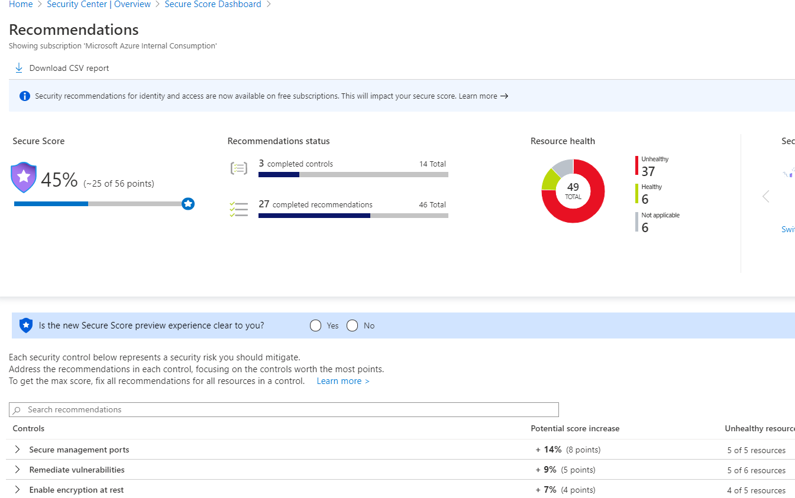

8. Go to *Security Center* **Overview** and select **Compute & apps**. Review the `Overview` and `VMs and Servers`.
	
	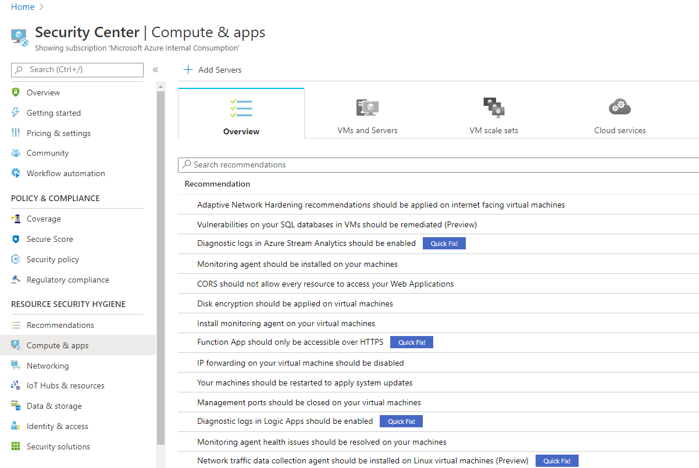

9. Go to *Security Center* **Overview** and select **File Integrity Monitoring**. Select your **Log Analytics Workspace** and click **Enable**.
	
	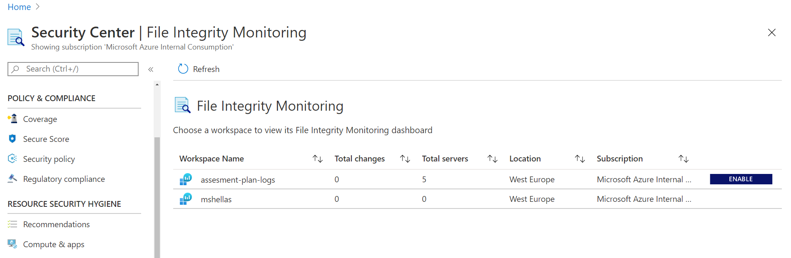

10. Let the solution to collect data and review from the left blade the solution that **Security Center** can offer.  More related tasks for security center [**here**](https://docs.microsoft.com/en-us/azure/security-center/security-center-onboarding).

### Task 5: Deploy Network Monitor Solution

1.  From **Your Device**, open your favorite browser (**Edge**) and connect to the Azure portal at: <https://portal.azure.com>.


### Task 6: Enable Azure Monitor

1.  From **Your Device**, open your favorite browser (**Edge**) and connect to the Azure portal at: <https://portal.azure.com>.

