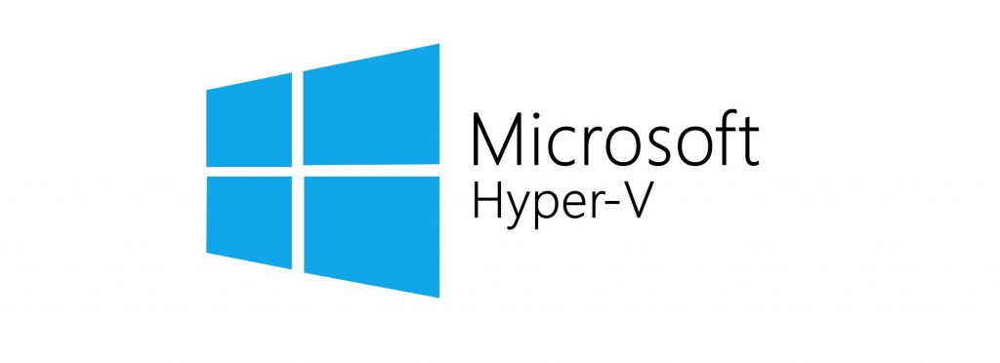
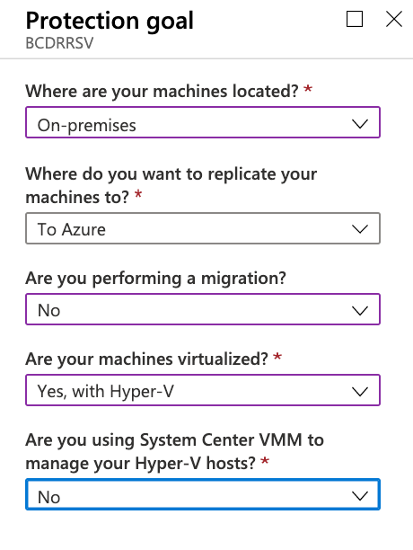

## Exercise 3: Configure Hyper-V Environments for failover

Duration: 30 minutes

In this exercise, you will configure the Hyper-V environments to use BCDR technologies found in Azure. The environment has unique configurations that must be completed to ensure their availability in the event of a disaster.

### Task 1: Configure on-premises to Azure IaaS failover

In this task, your **On Premises VM** will be configured to replicate to Azure and be ready to failover to the **BCDRCLOUDSRV**. This will consist of configuring your Hyper-V host with the ASR provider and then enabling replication of the VM to the Recovery Service Vault.

1. From the Azure portal, open the **BCDRCLOUDSRV** Recovery Services Vault located in the **BCDRRG** resource group.

2. Select **Site Recovery** in the **Getting Started** area of **BCDRCLOUDSRV** blade.

    

3. Next, select **Prepare Infrastructure** in the **For On-Premises Machines** section. This will start you down a path of various steps to configure your VM that is running on Hyper-V on-premises to be replicated to Azure.

    

4. On **Step 1 Protection Goal** select the following inputs and then select **OK**:

    - **Where are your machines located?**: On-premises
    - **Where do you want to replicate your machines to?**: To Azure
    - **Are you performing a migration?**: No
    - **I understand, but I would like to continue with Azure Site Recovery**: checked
    - **Are your machines virtualized?**: Yes, with Hyper-V  (Your VM is running as a nested VM in Azure).
    - **Are you using System Center VMM to manage your Hyper-V hosts?**: No

    

5. On **Step 2 Deployment planning**, confirm you have completed deployment planning by selecting **Yes, I have done it** then select **OK**.

    > **Note**: You can read more about planning an ASR to deployment here:
    >
    > <https://docs.microsoft.com/en-us/azure/site-recovery/site-recovery-hyper-v-deployment-planner>

    

6. On **Step 3 Prepare source** select **+Hyper-V Site**.

    

7. On the **Create Hyper-V site** blade, enter the name: `OnPremHyperVSite`. Select **OK**.

    

8. The portal will deploy the site providing you notifications. Wait for the creation process to complete, and the ASR portal will update once this is done. Your new site is now shown under **Step 1: Select Hyper-V site**.

    

    

9. Next select **+Hyper-V Server**.

    

10. A new blade will appear. You will need to download the vault registration key to register the host in the Hyper-V site of ASR. Select the Download button which will save the file to your Downloads folder on the **LABVM**.

    