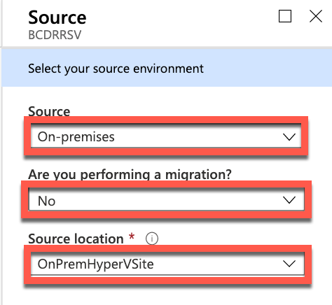
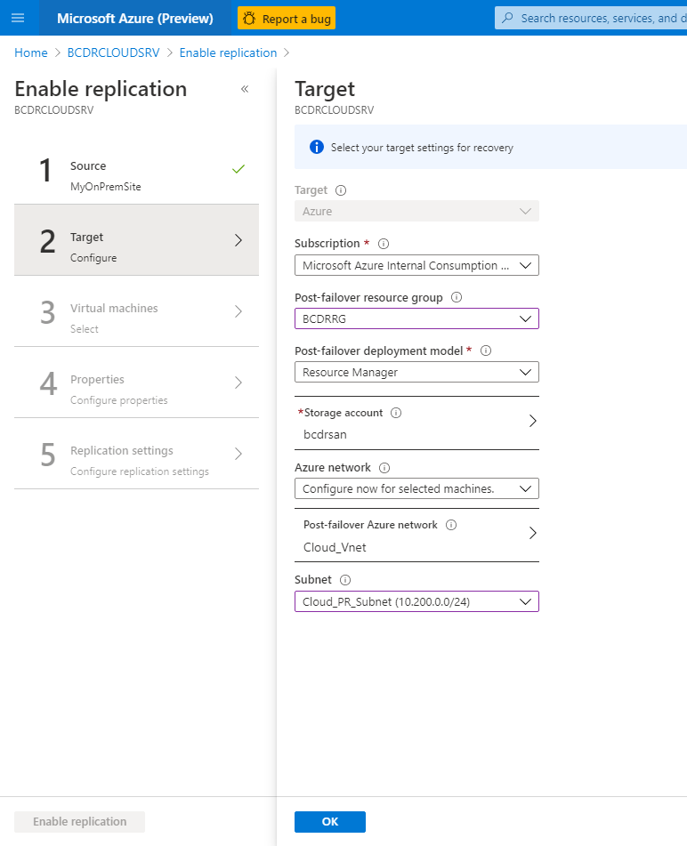
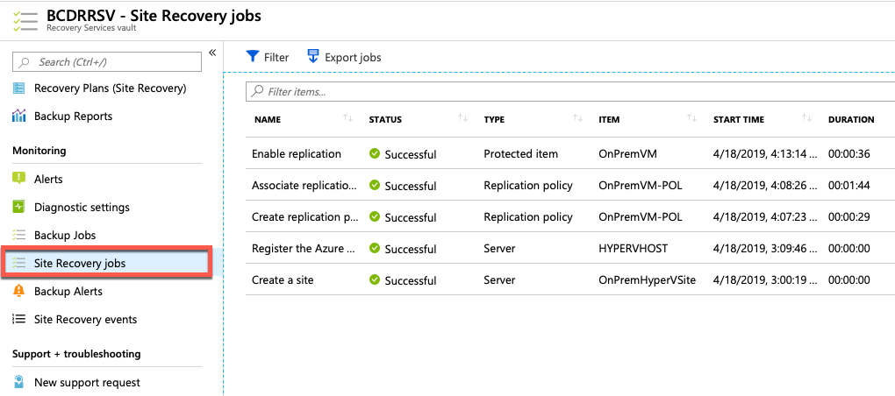
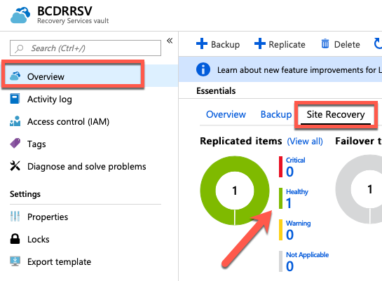
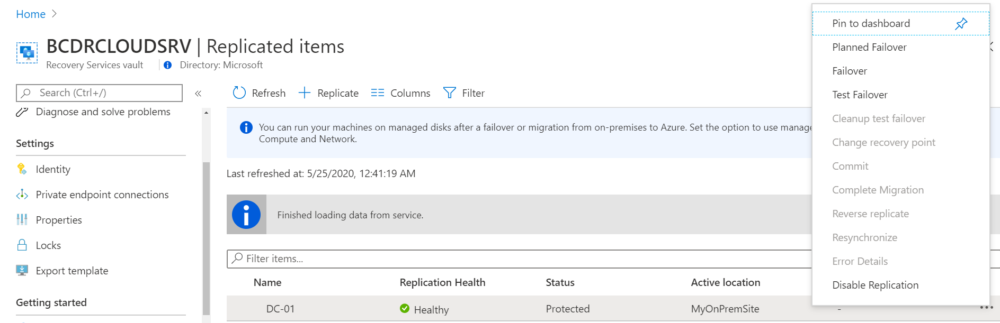
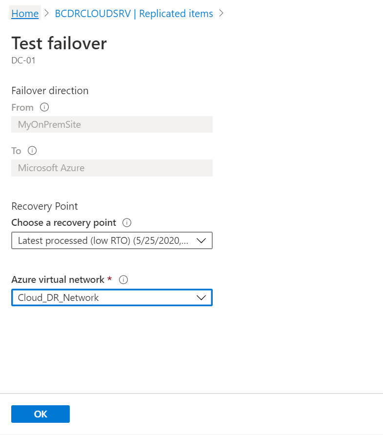
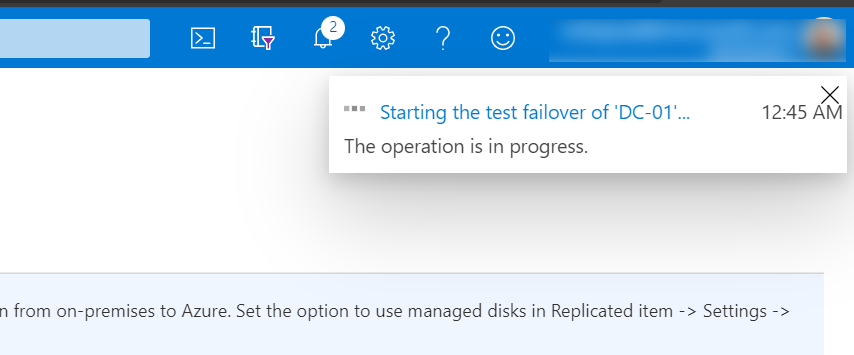
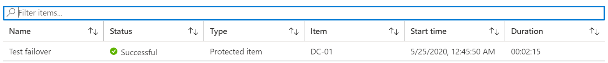
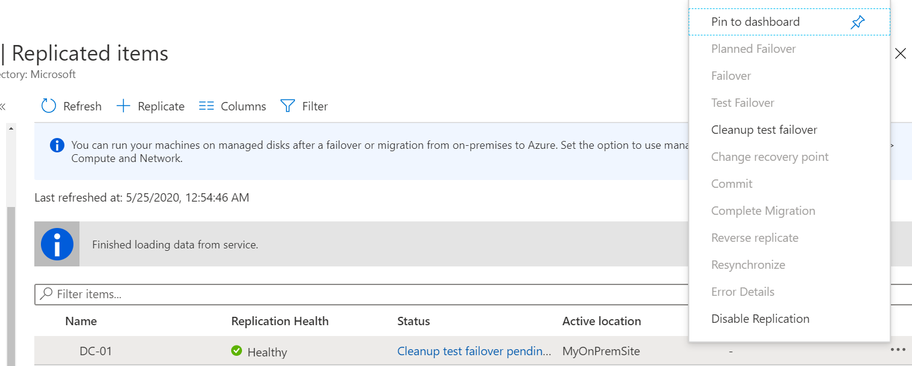

**Contents**

<!-- TOC -->

- [Exercise 3: Configure Hyper-V Environments for failover](#exercise-3-configure-hyper-v-environments-for-failover)
    - [Task 1: Configure on-premises to Azure IaaS failover](#task-1-configure-on-premises-to-azure-iaas-failover)
    - [Task 2: Register Your On-Premises Hyper-V](#task-2-register-your-on-premises-hyper-v)
    - [Task 3: Finalize Azure Environment and Create the First Replication](#task-3-finalize-azure-environment-and-create-the-first-replication)
    - [Task 4: Simulate Test Failover *Optional*](#task-3-simulate-test-failover)


<!-- /TOC -->

## Exercise 3: Configure Hyper-V Environments for failover

Duration: 45 minutes

In this exercise, you will configure the Hyper-V environments to use BCDR technologies found in Azure. The environment has unique configurations that must be completed to ensure their availability in the event of a disaster.

### Task 1: Configure on-premises to Azure IaaS failover

In this task, your **On Premises VM** will be configured to replicate to Azure and be ready to failover to the **BCDRCLOUDSRV**. This will consist of configuring your Hyper-V host with the ASR provider and then enabling replication of the VM to the Recovery Service Vault.

1. From the Azure portal, open the **BCDRCLOUDSRV** Recovery Services Vault located in the **BCDRRG** resource group.

2. Select **Site Recovery** in the **Getting Started** area of **BCDRCLOUDSRV** blade.

    

3. Next, select **Prepare Infrastructure** in the **For On-Premises Machines** section. This will start you down a path of various steps to configure your VM that is running on Hyper-V on-premises to be replicated to Azure.

    

4. On **Step 1 Protection Goal** select the following inputs and then select **OK**:

    - **Where are your machines located?**: On-premises
    - **Where do you want to replicate your machines to?**: To Azure
    - **Are you performing a migration?**: No
    - **I understand, but I would like to continue with Azure Site Recovery**: checked
    - **Are your machines virtualized?**: Yes, with Hyper-V  (Your VM is running as a nested VM in Azure).
    - **Are you using System Center VMM to manage your Hyper-V hosts?**: No

    

5. On **Step 2 Deployment planning**, confirm you have completed deployment planning by selecting **Yes, I have done it** then select **OK**.

    > **Note**: You can read more about planning an ASR to deployment here:
    >
    > <https://docs.microsoft.com/en-us/azure/site-recovery/site-recovery-hyper-v-deployment-planner>

    

6. On **Step 3 Prepare source** select **+Hyper-V Site**.

    

7. On the **Create Hyper-V site** blade, enter the name: `OnPremHyperVSite`. Select **OK**.

    

8. The portal will deploy the site providing you notifications. Wait for the creation process to complete, and the ASR portal will update once this is done. Your new site is now shown under **Step 1: Select Hyper-V site**.

    

    

9. Next select **+Hyper-V Server**.

    

10. A new blade will appear. You will need to download the vault registration key to register the host in the Hyper-V site of ASR. Select the Download button which will save the file to your Downloads folder on the **Hyper-V On Premises Server**.

    

### Task 2: Register Your On-Premises Hyper-V

In this task you will install the Azure Site Recovery Provider and you will register the Provider to the Site Recovery Vault **BCDRCLOUDSRV**.

1. If you not have already download the _Azure Site_Recovery_Provider_ Open Internet Explorer on **HYPERVHOST** and browse to the following URL. This will download the Azure Site Recovery Provider for Hyper-V.

    ```text
    http://aka.ms/downloaddra_cus
    ```

2. Start the **Provider Executable ** or if you are downloading Select **Run**.

    

3. Select **On** and then **Next**.

    

4. Select **Install** on the Provider Installation screen.

    

5. Once the Provider has been installed you will come to a screen that will request for you **Register** or **Finish**. Select **Register**.

    

6. Locate the vault registration key which you store before in the directory _Downloads_ of **Device**. Right-click the file and copy it. Move back to **Hyper-V Host** and paste the file to the desktop.

    

    

7. On the Vault Setting screen select **Browse**.

    

8. Locate the Vault file on the desktop and select **Open**.

    

9. The Vault Settings will now be populated. Select **Next**.

    

10. On the Proxy settings screen retain the settings **Connect directly to Azure Site Recovery without a proxy server** and select **Next**.

    

11. The provider will then connect and configure the Azure Site Recovery registration for the Hyper-V Server.

    

12. After a few minutes, the wizard will be complete with the message **The Server was registered in the Azure Site Recovery vault.** Select **Finish** to close the Provider installation.

    

### Task 3: Finalize Azure Environment and Create the First Replication

1. You will need to return to the Prepare Source screen and select **+Hyper-V Server**. Notice the warning that it could take up to 30 mins for this server to appear, but in practice you should cancel out of this window by selecting Step 2 and then answer yes again with **I have done it** to the question of Deployment planning.

    

2. Once the Server appears, select **OK**.

    

3. On **Step 4 Target Prepare** review the screen to better understand the various steps. Select **+Storage account** to add a storage account that will be used for the **On Premises Hypervisor** when it is failed over to Azure.

    

4. Select **Create New** and provide a unique name for your storage account containing the name of the VM **choose a name** with added characters to make it unique. Also, select the Premium tier for the storage account and select **OK**.

    

    > **Note:** Be sure to select **Premium** Performance or you may run into issues later in the lab.

5. Select **+Storage account** again and create a second storage account using the **Standard** performance tier, then select **OK**.

6. The portal will submit a deployment, and you must wait until this completes. It will be created in the **BCDRRG** resource group.
  
    

7. You will be failing the **On Premises Virtual Machine** into the **Azure** site that was deployed earlier, so you already have a Virtual Networks created. Select **OK** on the Target blade to continue.

    

8. On the **Replication Policy** screen, select the **+Create and Associate** item.

    

9. Enter the name: `OnPremVM-POL`. Review the settings that you can configure and then select **OK**.

    

10. Azure will run a deployment and start the process of creating and then associating the Hyper-V Site with the replication policy.

    

    

    > **Note**: This will take a couple of minutes to complete. Please wait until this completes prior to moving on.

    Once complete, select **OK**.

    

11. Select **OK** again, and the process for adding the Hyper-V Server to the Recovery Services Vault will be complete.

    

12. Next, select Step 1: **Replicate Application**.

    

13. On the Source blade select: **Source**: **On-premises**, **Are you performing a migration**: **No**, and **Source location**: **OnPremHyperVSite** and select **OK**.

    

14. Complete the Target blade, select the following values:

    - **Post-failover resource group**: **BCDRRG**
    - **Storage Account**: Select the account you just created _Example_(**onpremvm8675309**).
    - **Storage Account for replication logs**: Create a *new* one using the prefix **bcdrasrrepllogs**.
    - **Azure network**: Configure now for selected machines.
    - **Post-failover Azure network**: **Cloud\_VNet\_Production**
    - **Subnet**: **Cloud\_PR\_Subnet** _10.200.0.0/24_

    

15. Next on the **Select virtual machines** select **Your On Premises Virtual Machine** and then select **OK**.

    

16. Complete the **OnPremVM** selections of the **Configure properties** blade using these inputs and then select **OK**:

    - **OS Type**: Linux or Windows _what you choose in your environment_
    - **OS Disk**: _Disk Name_
    - **Disks to Replicate**: _Disk Name_ \[127.00GB\]

    

17. On the **Configure replication settings** blade review the selections and notice that the **OnPremVM-POL** that you created has been selected. Select **OK**.

    

18. On the final screen, select **Enable replication**.

    

19. The deployment will be submitted. You can select **Site Recovery Jobs** to review the process.

    

20. After a few minutes, the Enable replication will move to Successful. Select **Overview** and **Site Recovery** on the **BCDRRSV** blade. You should now see that there is one (1) Healthy Replicated Item.

    

21. Select **Healthy 1** and you will see the replicated items list. Notice it shows that the VM is healthy, but the replication has just started, so it shows **0% synchronized**. It will take a few minutes for the VM to replicate.

    

    > **Note**: If the **OnPremVM** does not immediately go to a healthy replication  state, or ever gets in an unhealthy state, you may need to "Disable Replication" and recreate it using the steps above.

22. Select **OnPremVM**. Review the Replication details for **OnPremVM**. Once the VM has replicated, the selections across the top menu bar of the dashboard will allow you to work with this VM.

    

    > **Note**: It will take about 15 minutes for the VM to replicate, so you can move on and come back to review the environment later.

23. Scroll down and review the Infrastructure view of the BCDR environment you have created for **OnPremVM**. You can select **Hyper-V Virtual Machine** to review what is protected.

    

    

24. Next, select **Compute and Network**.

    

25. Details of the VM will be shown, and you can make configuration changes. Change the **Size** of the VM to **DS2\_v2,** and then select **Save**.

    

> **Note**: It could take a few minutes for these screens to populate, so be patient. You can come back to this step later to adjust the size if you wish.


### Task 4: Simulate Test Failover _Optional_

On this task you will simulate the and use the **Test Failover Functionality** of Site Recovery vault.


1. From the Azure portal, open the **BCDRCLOUDSRV** Recovery Services Vault located in the **BCDRRG** resource group.

 
2. Open the **BCDRCLOUDSRV** and select **Replicated Items** under the **Protected Items** area. Make sure that **OnPremVM** shows up ad **Replication Heath**: **Healthy.** Select **OnPremVM**.

    

    

3. Right-click **OnPremVM** and then select **Test Failover**.

    

4. Select you your latest **recovery point**  verify that **From** is set to **MyOnPremSite** and **To** is set to **Microsoft Azure**, for **Azure virtual network** choose **Cloud\_DR\_Network** and press **OK**.

    

5. The Azure portal will provide a notification that the Test failover is starting.

    

6. By selecting Site Recovery Jobs, you can monitor the progress of the failover.

    

7. Once the Failover Status is *Successful* in Site Recovery Jobs, go to **Virtual Machines** and you will see your **OnPremVM** with status **Running**.

    

8. In order to access the Virtual Machine **OnPremVM** you need to deploy a Virtual Machine in this network because it is isolated.

9. When you finish your health check go again back to **BCDRCLOUDSRV** Site Recovery vault in the _Replicated items_. You will see your **OnPremVM** with status **Cleanup test ...**. 


10. Go to the left side on **...** and when the new blade appears select **Cleanup test failover**.

    

11. Enter your Notes for the testing, Check **Testing is Complete** and press **OK**. This will delete your Test Failover Virtual Machine.


