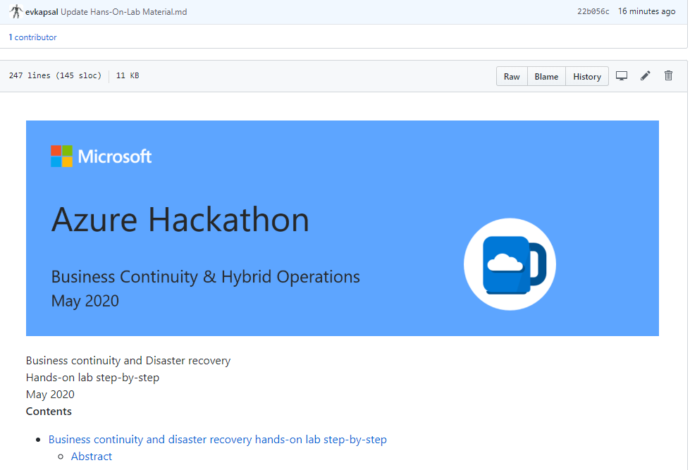

# Business continuity and disaster recovery

Organization is willing to build a business continuity plan based on Microsoft Azure Site Recovery Services. Also is trying to identify the services that are running within the organization and provide a dynamic service dependency map.

May 2020

## Target audience

- Infrastructure Architects
- Cloud Solution Architects
- Infrastructure Administrators

## Abstracts

### Workshop

In this workshop, you will gain experience designing solutions using Azure business continuity and disaster recovery (BCDR) technologies.
At the end of this workshop, you will be better able to leverage various Azure technologies together to build a complex and robust IaaS BCDR plan.

### Hands-on lab

In the hands-on lab, you will implement Azure BCDR technologies to achieve Infrastructure Failover environment for your on premises Hyper-V / VMWare virtualization. At the end of this hands-on lab, you will be better able to build a complex and robust IaaS BCDR solution.

### Azure services and related products

- Azure Site Recovery
- Azure Log Analytics
- Azure Monitor
- Azure Security Center
- Azure Network
- Azure VPN Gateway

### Azure solutions

Business Continuity, Disaster Recovery ,Log Analytics, Security Center, Networking

### Hands On Lab Material

Please start your hands on lab [Material](Hans-On-Lab%20Material.md) and follow the guide.

## Related references

- [MCW](https://github.com/Microsoft/MCW)